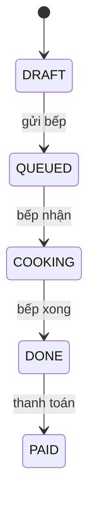
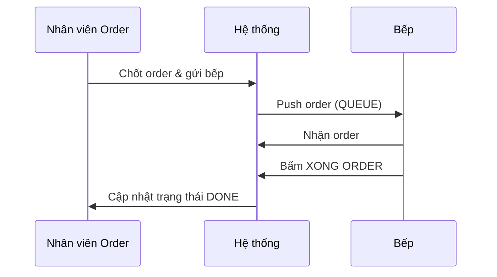

# PRD – Web App Quản Lý Order Quán Ăn Chay

## 1. Mục tiêu

Xây dựng một web app realtime giúp quán ăn:

* Nhân viên order nhanh, ít sai sót
* Bếp xử lý món đúng thứ tự, không bị gián đoạn
* Kế toán tổng kết doanh thu – lợi nhuận chính xác
* Phù hợp vận hành quán đông, khách hay gọi thêm / đổi 1 phần

App gồm 3 phần chính: **Order – Bếp – Kế toán**. Mỗi phần có thể hoạt động độc lập hoặc phối hợp realtime.

---

## 2. Phạm vi & nguyên tắc thiết kế

* App **luôn online**, dùng realtime (Socket.io)
* Không login, mở app chọn role
* 1 bếp, xử lý **1 order tại một thời điểm**
* Ưu tiên thao tác nhanh, hạn chế nhập tay
* Khi bếp đang làm thì **không chỉnh sửa / huỷ order**

---

## 3. Các vai trò (Roles)

### 3.1 Nhân viên Order

* Nhận order tại bàn
* Chỉnh sửa order khi còn trong hàng đợi
* Thêm món khi bếp đang nấu
* Tính tiền cho bàn

### 3.2 Bếp

* Nhận order theo thứ tự FIFO
* Xem toàn bộ món trong 1 order
* Chỉ thao tác: **XONG ORDER**

### 3.3 Kế toán

* Quản lý menu & giá
* Xem thống kê bán hàng
* Tính doanh thu & lợi nhuận

---

## 4. Quy trình Order (Nhân viên)

### 4.1 Chọn bàn

* Chọn bàn từ danh sách
* Nếu bàn chưa có order → tạo order mới
* Nếu bàn đã có order → mở chi tiết

### 4.2 Chọn món (Draft Order)

#### Cấu trúc chọn món

1. **Món chính** (bắt buộc)

   * Hủ tiếu chay
   * Bún bò chay

2. **Option bánh / sợi** (bắt buộc – 1 chọn)

   * Hủ tiếu, Hủ tiếu mì, Mì, Bánh canh, Bún…

3. **Option đặc biệt** (không tính tiền – multi)

   * Không hành, không giá, ít bánh, không tàu hủ…

4. **Option rau** (tuỳ món)

   * Rau trụng, rau sống, không rau, chỉ lấy giá…

5. **Option size** (1 chọn, mặc định)

   * Tô thường (default)
   * Tô em bé

6. **Option thêm – Phụ phí** (tính tiền)

   * Hoành thánh thêm, tàu hủ ky thêm, trà đá, nước ngọt…

7. **Số lượng**

   * Chọn số lượng cho cấu hình món

---

## 5. UI Chốt Order Trước Khi Gửi Bếp (Quan trọng)

### 5.1 Mục đích

* Đọc lại order cho khách
* Cho phép chỉnh **từng tô** trong số lượng

### 5.2 UI gộp (Layer 1)

Ví dụ:

* Hủ tiếu chay – Hủ tiếu – Tô thường x4
* Bún bò chay – Bún – Tô thường x3

### 5.3 Tách theo số lượng (Layer 2)

Khi click vào dòng x4:

* Tách thành 4 tô độc lập
* Mỗi tô có thể chỉnh option riêng

### 5.4 Gộp lại trước khi gửi bếp

Sau chỉnh sửa:

* Các tô giống cấu hình → gộp lại thành xN
* Tô khác option → thành dòng riêng

---

## 6. Quy tắc chỉnh sửa & huỷ order

### 6.1 Trạng thái Order

* `QUEUED`: đang chờ bếp
* `COOKING`: bếp đang làm
* `DONE`: bếp xong
* `PAID`: đã thanh toán

### 6.2 Quy tắc

| Trạng thái | Thêm | Sửa | Huỷ |
| ---------- | ---- | --- | --- |
| QUEUED     | ✅    | ✅   | ✅   |
| COOKING    | ❌    | ❌   | ❌   |
| DONE       | ❌    | ❌   | ❌   |

---

## 7. Thêm món khi bếp đang COOKING

* Tạo **order mới** cho cùng bàn
* Order mới được **chèn lên đầu hàng QUEUED**
* Đảm bảo được làm **ngay sau order đang nấu**

---

## 8. Quy trình Bếp

### 8.1 Nguyên tắc

* 1 order / 1 màn hình
* Hiển thị full danh sách món
* Không hiển thị giá
* Không chỉnh sửa

### 8.2 Thao tác

* Nhận order theo FIFO
* Bấm **XONG ORDER** (Enter / Space)

---

## 9. Kế toán

### 9.1 Quản lý menu

MenuItem:

* Tên
* Giá bán
* Giá vốn
* Loại: MAIN / ADDON
* Active

### 9.2 Thống kê

* Tổng order đã PAID
* Số lượng món bán ra
* Doanh thu
* Lợi nhuận

---

## 10. Data Model (Tóm tắt)

### Order

* id
* tableNumber
* status
* items[]
* createdAt

### OrderItem

* menuItemId
* quantity
* configDetail

---

## 11. State Machine – Order

---

## 12. Sequence Diagram – Order ↔ Bếp

